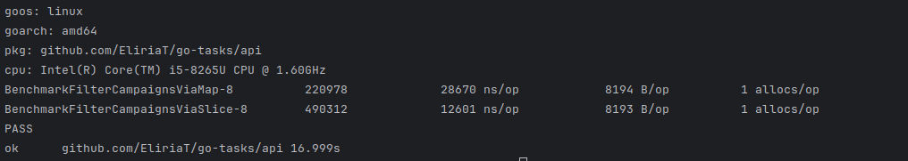
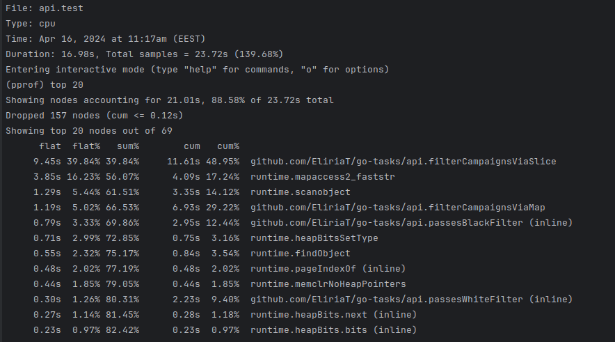
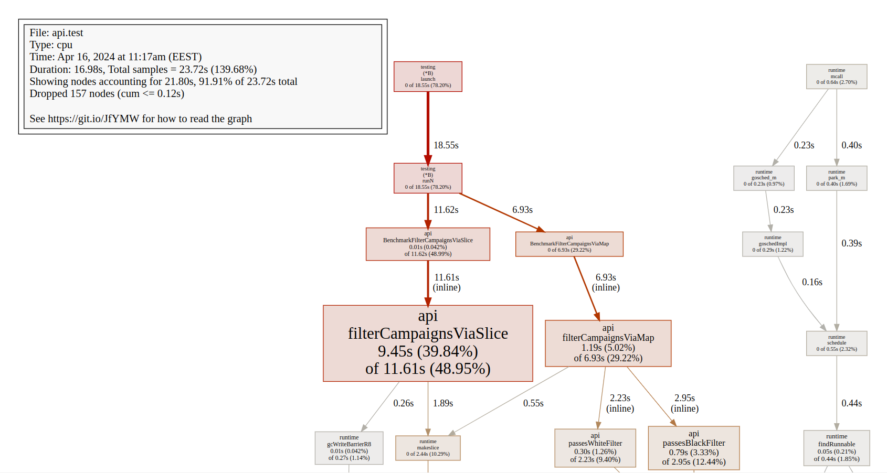
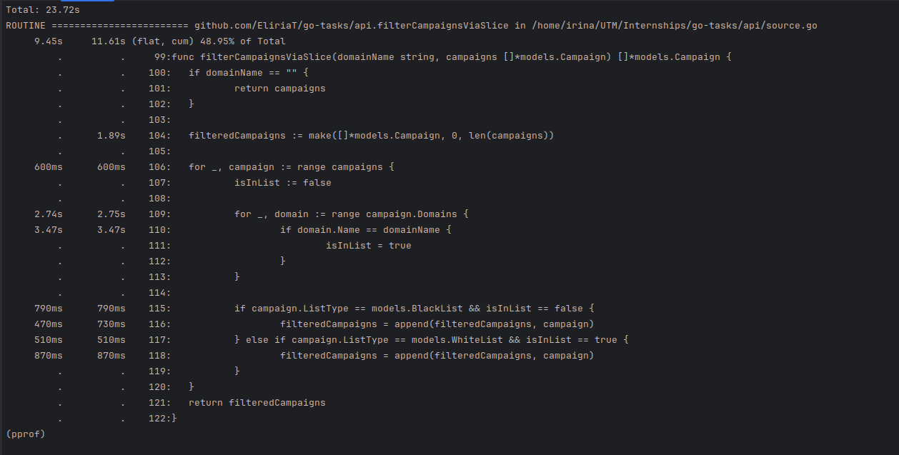
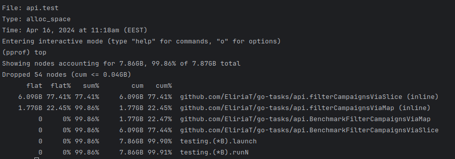
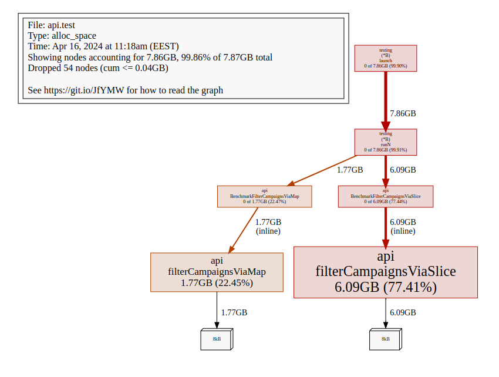

# go-tasks

Benchmark results:

From the cpu profiler results we can see that `filterCampaignsViaSlice` takes much more time to run in comparing to
`filterCampaignsViaMap` (11.61 vs 6.93s)

A more comprehensive graph:

Memory profile results:

To run the benchmark test:
`cd api`

`go test -bench=. -benchtime 5s -benchmem`

**Queries are in `hw1.sql`**

**Schema generation code is in `db/migrations` folder**

**Seeding was done in an overcomplicated way.**

**To run the tasks:**
1. `docker compose build` 
2. `docker compose up`

Running `docker compose up` will run all the migrations, seeding.

Database available at: user:password@tcp(sources_db:3306)/sources

Useful commands:

To start the mariadb client inside the sources_db container:
`docker exec -it sources_db mariadb -uusername -ppassword`

To run the migrations:
`make migrateup`

To rollback the migrations:
`make migratedown`

To build the go image:
`docker compose build`

To run the small environment:
`docker compose up --remove-orphans`

To create several migration files:
`make create_migration create_sources_associated_campaigns_table create_sources_table`